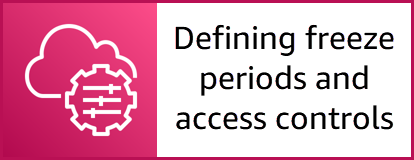

# Codifying Runbooks for common tasks


NOTE: You will incur charges as you go through either of these workshops, as they will exceed the [limits of AWS free tier](http://docs.aws.amazon.com/awsaccountbilling/latest/aboutv2/free-tier-limits.html).

## Table of Contents

- [Summary](#summary)
- [Instructions](#instructions)
    - [Create a Command document](#create-a-command-document)
    - [Run the document against a managed instance](#run-the-document-against-a-managed-instance)
- [Next Section](#next-section)

## Summary

An **AWS Systems Manager document (SSM document)** defines the actions that Systems Manager performs on your managed instances. Systems Manager includes more than 290 pre-configured documents that you can use by specifying parameters at runtime. Documents use JavaScript Object Notation (JSON) or YAML format, and they include steps and parameters that you specify.

There are multiple document types for different Systems Manager capabilities. The different document types can be reviewed here:

[Systems Manager Documents](https://docs.aws.amazon.com/systems-manager/latest/userguide/sysman-ssm-docs.html)

You can use pre-defined AWS managed documents or create your own depending on your use case.

In this section we will create a custom ```Command``` document and run the document on a managed instance using **Systems Manager Run Command**. 

**Run Command** lets you remotely and securely manage the configuration of your managed instances. A managed instance is any EC2 instance or on-premises machine in your hybrid environment that has been configured for Systems Manager. Run Command enables you to automate common administrative tasks and perform ad hoc configuration changes at scale. You can use Run Command from the AWS Management Console, the AWS Command Line Interface, AWS Tools for Windows PowerShell, or the AWS SDKs. Run Command is offered at no additional cost.

## Instructions

### Create a Command document

1. Open the AWS Systems Manager console at https://us-east-1.console.aws.amazon.com/systems-manager.
1. In the navigation pane, choose [**Documents**](https://console.aws.amazon.com/systems-manager/documents).
1. Inside here you will be able to see all documents available to your account for the given AWS Region. There are four different tabs:
    - **Owned by Amazon:** Managed Documents published and maintained by AWS.
    - **Owned by me:** Custom Documents your organization has created.
    - **Shared with me:** Documents that you have been granted access to for the given AWS Region.
    - **All documents:** Display all documents available to your account for the given AWS Region.
1.  Choose **Create document** and then choose **Command or Session**
    - For **Name**, enter ```org-install-app```.
    - For **Target type - *optional***, leave the value blank for now.
        - Target Type allows you to restrict the types of resources the document can run against.
    - For **Document type - *optional***, leave **Command document** as we will use Run command to install the package.
    - For **Content**, copy and paste the below snippet:

    ```
    {
        "schemaVersion": "2.2",
        "description": "Command Document Example JSON Template",
        "parameters": {
            "Message": {
                "type": "String",
                "description": "The message to display",
                "default": "Prepping Web Instance"
            }
        },
        "mainSteps": [
            {
                "action": "aws:runShellScript",
                "name": "prepare_web_instance",
                "inputs": {
                    "runCommand": [
                        "echo {{Message}}",
                        "sudo yum install httpd -y",
                        "mkdir /app",
                        "touch /app/hello.txt",
                        "sudo systemctl start httpd"
                    ]
                }
            }
        ]
    }
    ```

    

1. Choose **Create Document** to save the document.
1. Choose the **Owned by me** tab and select the new document you created, ```org-install-app```.
    - Choose the **Content** tab and review the contents of the document. We will run this document on our managed instances using **Run Command**.

### Run the document against a managed instance

1. Open the AWS Systems Manager console at https://console.aws.amazon.com/systems-manager/.
1. In the navigation pane, choose [**Run Command**](https://console.aws.amazon.com/systems-manager/run-command).
1. Choose **Run command**.
1. Select inside the search box under **Command Document** to apply a filter.
    - Select ```Owner : Owned by me```.
    - Select the document ```org-install-app```.
1. For **Document version**, select **Latest version at runtime**.
1. In the **Commands parameters** section, leave the default value for our parameter **Message** as ```Prepping Web Instance```.
1. In the **Targets** section, choose **Choose instances manually** and select the two EC2 instances created by the CloudFormation stack in the previous section ```App1``` and ```App2```.
1. Leave **Other parameters** and **Rate Control** options as default.
1. Uncheck **Enable writing to an S3 bucket**.
1. Choose **Run**.
1. Select the refresh icon until **Status** changes to **Success**.
1. You will be brought over to the Command Status of the Run Command invocation you initiated.

    

1. Select the radio button next to one the instance IDs and choose **View Output**.
    - This will drill down into the details about the invocation of the **Run Command** operation and to review the output returned by ```stdout```.
    - Expand **Output**.
        - **Important**: The command output displays a maximum of 48,000 characters. If the command results are truncated, you can view the complete command output in either Amazon S3 or CloudWatch logs, if you specify an S3 bucket or a CloudWatch logs group when you run the command.

    

## Next Section

Click the link below to go to the next section.

[](/episode-01-step-03-define-freeze.md)