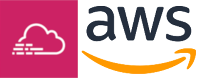
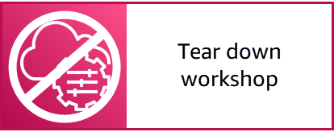

# Querying AWS CloudTrail Logs in Amazon Cloudwatch Logs Insights 



NOTE: You will incur charges as you go through either of these workshops, as they will exceed the [limits of AWS free tier](http://docs.aws.amazon.com/awsaccountbilling/latest/aboutv2/free-tier-limits.html).

## Table of Contents

- [Summary](#summary)
- [Instructions](#instructions)
- [Next Section](#next-section)

## Summary

CloudWatch Logs Insights enables you to interactively search and analyze your log data in Amazon CloudWatch Logs. You can perform queries to help you more efficiently and effectively respond to operational issues. If an issue occurs, you can use CloudWatch Logs Insights to identify potential causes and validate deployed fixes.

CloudWatch Logs Insights automatically discovers fields in logs from AWS services such as Amazon Route 53, AWS Lambda, AWS CloudTrail, and Amazon VPC, and any application or custom log that emits log events as JSON. In this lab exercise, we will query CloudTrail events CloudWatch Logs data with Insights and add it to a CloudWatch Dashboard.

In this section you will (1) create a dashboard in Amazon CloudWatch and (2) use Amazon CloudWatch Logs Insights to query AWS CloudTrail.

## Instructions

1.	Go to the [CloudWatch Dashboards](https://console.aws.amazon.com/cloudwatch)
1.	Click Create dashboard 
    -   Give a dashboard name ```WorkshopDashboard```
    -   Click Create dashboard
1.	Select a widget type to configure: Logs table (Explore results from Logs Insights) and click Next
1.	From the drop down, select the CloudWatch Log Group created during the setup.
1.	In the query pane, enter the following query, which filters Number of log entries by region and EC2 event type.
```
filter eventSource="ec2.amazonaws.com"
| stats count(*) as eventCount by eventName, awsRegion
| sort eventCount desc
```
1.	Click on Run Query to view results. 
1.	Click on Create widget and you will see your first dashboard created. 

**Note:** The [CloudWatch Logs Insights Console](https://console.aws.amazon.com/cloudwatch/home#logsV2:logs-insights) has a few sample queries to start with under Sample queries. Refer this [document](https://docs.aws.amazon.com/AmazonCloudWatch/latest/logs/CWL_QuerySyntax-examples.html) for more information.

## Next Section

Click the link below to go to the next section.

[](/episode-02-step-05-tear-down.md)
