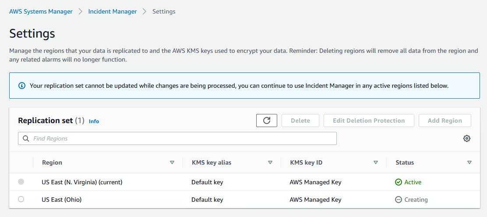
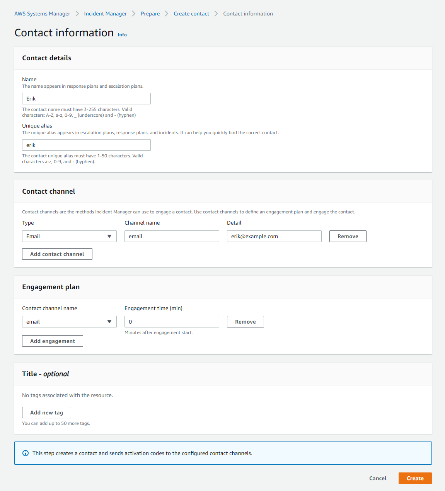

# Prepare for incidents using Incident Manager


NOTE: You will incur charges as you go through either of these workshops, as they will exceed the [limits of AWS free tier](http://docs.aws.amazon.com/awsaccountbilling/latest/aboutv2/free-tier-limits.html).

## Table of Contents

- [Summary](#summary)
- [Instructions](#instructions)
    - [Configure Incident Manager to replicate data](#configure-incident-manager-to-replicate-data)
    - [Create contact details](#create-contact-details)
    - [Create an escalation plan](#create-an-escalation-plan)
    - [Create a response plan](#create-a-response-plan)
    - [Create an Amazon Event Bridge rule to monitor](#create-an-amazon-event-bridge-rule-to-monitor)
- [Next Section](#next-section)

## Summary

In this section you will (1)...

## Instructions

### Configure Incident Manager to replicate data

**To replicate Incident Manager data to other AWS Regions**

1. Open the AWS Systems Manager console at https://console.aws.amazon.com/systems-manager/.
1. In the navigation pane, choose [**Incident Manager**](https://console.aws.amazon.com/systems-manager/incidents).
1. Choose **Prepare**.
1. On the **Get prepared** page, choose **Go to Settings** in the **General settings** section.
1. On the **Settings** page, choose **Add Region**.
1. In the **Add Region** window, choose **US East (Ohio)** from the drop-down list, and choose **Add**.

The replication set for Incident Manager will begin to be processed. You can continue to move forward with the next steps.



### Create contact details

1. Open the AWS Systems Manager console at https://console.aws.amazon.com/systems-manager/.
1. In the navigation pane, choose [**Incident Manager**](https://console.aws.amazon.com/systems-manager/incidents).
1. Choose **Prepare**.
1. On the **Get prepared** page, choose **Create contact** in the **Contact details** section.
1. In the **Contact details** section, perform the following steps:
    
    - For **Name**, enter your first name.
    - For **Unique alias**, enter a unique alias, this can simply be the lowercase version of your name.
    
1. In the **Contact channel** section, perform the following steps:

    - For **Type**, choose **Email**.
    - For **Channel name**, enter ```email```.
    - For **Detail**, enter your email address.
    
1. In the **Engagement plan** section, perform the following steps:

    - For **Contact channel name**, choose **email** created above.
    - For **Engagement time (min)**, leave the default value ```0```.
    - :information_source: Outside of the workshop, you can specify varying engagement times on when contacts should be engaged as part of incidents that take occur.
    
    <details>
    <summary><b>:information_source: Example Contact information</b></summary><p>

    

    </p></details>
    
1. Choose **Create**.

This step creates a contact and sends activation codes to the configured contact channels. You will then be brought to a subsequent page to activate the contact channel using an activation code in an email you will receive.

**To activate the contact channel**

1. On the **Contact channel activation - optional** page, perform the following steps:

    - For **Activation code**, enter the six-digit code specified in the email sent by AWS.

1. Choose **Finish**.

Repeat the process above to create a second contact. For the second contact, specify **Name** and **Unique alias** as ```yourname-escalated``` and specify **Engagement time (min)** as ```15```.

### Create an escalation plan

Escalation plans use **stages** where each stage lasts a defined number of minutes. Each stage has the following information:

- **Duration** - The amount of time the plan waits until beginning the next stage. As soon as the engagement starts the first stage begins.
- **Contacts** - The escalation plan engages each contact using its defined engagement plan. You can set up each contact to stop the progression of the escalation plan before it goes to the next stage. Each stage can have multiple contacts.

**To create an escalation plan**

1. Open the AWS Systems Manager console at https://console.aws.amazon.com/systems-manager/.
1. In the navigation pane, choose [**Incident Manager**](https://console.aws.amazon.com/systems-manager/incidents).
1. Choose **Prepare**.
1. On the **Get prepared** page, choose **Create escalation plan** in the **Escalation plans** section.
1. On the **Create escalation plan** page, perform the following steps:

    - For **Name**, enter ```workshop-escalation-plan```.
    - For **Alias**, enter ```workshop-escalation```.
    - Before making modifications to **Stage 1**, choose **Add stage**.
    - For **Stage 1**, perform the following steps:
        - For **Stage duration** enter ```15```.
        - For **Contact name**, select the first contact you created above (```yourname```) and disable **Acknowledgement stops plan progression**.
        - :information_source: By disabling this option, the engagement plan will escalate to **Stage 2** 15 minutes after the incident has been created.
    - For **Stage 2**, perform the following steps:
        - For **Contact name**, select the second contact you created above (```yourname-escalated```) and disable **Acknowledgement stops plan progression**.

1. Choose **Create escalation plan**.
    


### Create a response plan

Use response plans to plan for incidents and define how to respond to incidents. Response plans provide a template for when an incident occurs. This template includes information about who to engage, the expected severity of the event, automatic runbooks to initiate, and metrics to monitor. To create a response plan, use the following steps. 

**To create a response plan**

1. Open the AWS Systems Manager console at https://console.aws.amazon.com/systems-manager/.
1. In the navigation pane, choose [**Incident Manager**](https://console.aws.amazon.com/systems-manager/incidents).
1. Choose **Prepare**.
1. On the **Get prepared** page, choose **Create response plan** in the **Response plan** section.
1. For **Response plan details**, enter the following:

    - For **Name** enter ```sampleapp-performance-issues-response-plan```.
    - For **Display name**, enter ```SampleApp Performance Issues response plan```.
    
1. For **Incident creation details**, enter the following:

    - For **Title**, enter ```[SampleApp] Performance Issues Detected```.
    - Expand the **Additional options** section and enter the following:
    
        ```
        ### :fire: :fire: :fire: **Incident in Progress** :fire: :fire: :fire:

        ---

        #### Summary of Incident

        Sample App resources are experiencing performance issues currently. Escalating to the workshop contact users for immediate resolution.

        #### Current Status

        <Responder to fill out details here>
        ```
    
    - For **Dedupe string**, enter ```SampleAppPerformance```.

1. For the purpose of this workshop, skip the **Chat channel** section.
1. For **Engagements**, choose **workshop-escalation-plan** from the drop-down list.
1. For the **Runbook** section, perform the following steps:

    - Choose **Clone runbook from template**.
    - For **Runbook name** enter ```sampleapp-response-runbook```.
    - For **Execution permissions**, choose **Create an IAM role using a template**.
    - For **Role name**, enter ```IncidentManager-role```.

1. Choose **Create response plan**.


### Create an Amazon Event Bridge rule to monitor

## Next Section

Click the link below to go to the next section.

[](/episode-05-step-02-codify-runbooks.md)